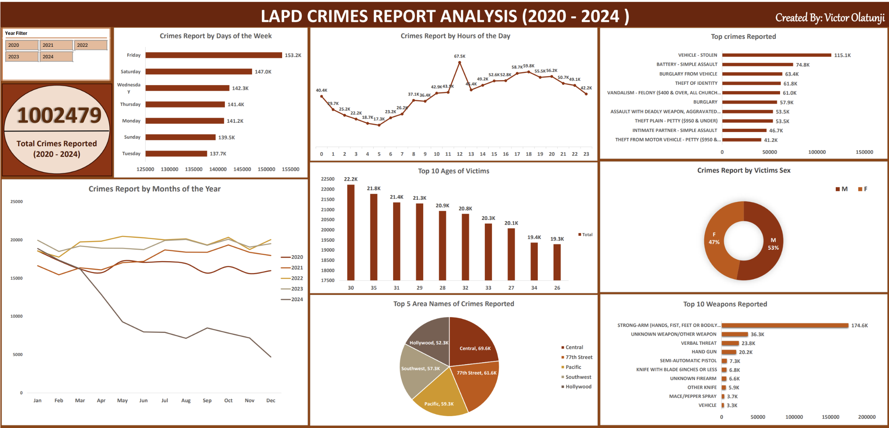

# LAPD CRIMES REPORTS ANALYSIS 2020 - 2024 (Excel)

### Project Overview
An Exploratory Data Analysis of 1,000,000+ unique crimes reported 
in Los Angeles (2020 - 2024) using Microsoft Excel and Power Query.

This project uncovered the total volume of crimes reported, the nature 
and distribution of crime types, temporal patterns and trends across 
hours, days and months, victim demographics and geographic hotspots,
ultimately delivering data driven recommendations to support crime 
prevention and resource allocation strategies in Los Angeles.

### Dashboard Preview
### Page 1 — Crash Overview

### Dataset
| Version | Download |
|---------|----------|
| **Raw Data** | [Download Raw Dataset](https://drive.google.com/drive/folders/12zvTYVBYDRy3A_vB05LC4kMWtlH0TbU1?usp=drive_link)|
| **Cleaned Data**  | [Download Cleaned Dataset](https://drive.google.com/file/d/1sk5GQxoC4h8a8z2N37isLj3bvyM1ALi6/view?usp=drive_link) |

## Dashboard File
The full interactive Excel dashboard including Power Query automation, 
Pivot Tables and all visualizations can be accessed and downloaded below:

| File | Download |
|------|----------|
| **LAPD Crimes Dashboard (.xlsx)** | [Download Dashboard](https://github.com/Victor-96-DA/LAPD-Crimes-Reports-Analysis-Excel/releases/download/v1.0/LAPD-CRIMES-Data-Analytic-Project.xlsx) |

> **Note:** To use the automation feature, ensure the data folder 
> is connected to Power Query after downloading.
> Requires Microsoft Excel with Power Query enabled.

### Tools & Technologies
- **Excel** — Dashboard and visualizations
- **Power Query** — Data cleaning and transformation
- **DAX** — Measures and custom calculations

### Project Stages
1. **Data Collection** — LAPD Crimes Dataset (2020 - 2024)

2. **Data Cleaning** — Power Query Transformations
   - Identifying and removing duplicates
   - Standardising text values — trimming, uppercase and proper case as appropriate
   - Resolving inconsistent data types across columns
   - Writing custom formulas to clean and standardise inconsistent data
   - Standardising date and timestamp formats
   - Splitting combined columns into separate structured columns
   - Handling null and blank values

3. **Data Transformation** — DAX Measures and Calculated Columns
   - Created measures for crime counts and aggregations
   - Extracted time intelligence columns (Year, Month, Hour)

4. **Data Modelling** — Power Pivot relationships and calendar table

5. **Dashboard Generation** — Interactive Automated Excel Dashboard
   - Pivot Tables connected to Power Query
   - Dynamic charts and slicers
   - Fully automated on data refresh ✅

### Key Findings
- 1,002,479 unique occurrences of crimes between 2020 - 2024 with 2022 being the year with the most crimes occurrences with a total of 235,116.
- The analysis also showed a significant and sustained decline throughout 2024 compared to previous years. Further investigation recommended. 
- Friday and Saturday saw the highest crime volumes while Tuesday had the least crimes
- Contrary to popular belief that late nights are the highest crime hours, this analysis uncovered an unconventional trend showing 12PM as the highest crime hour with 67.5K incidents recorded
- Stolen vehicles, battery, burglary from vehicles, and identity theft dominate the crimes description with Stolen vehicles topping with a total of 115.1K. The data analysis shows that Vehicle-related offenses are a clear priority
- Crime Hotspots – Central division leads (69.6K reports), followed by 77th Street and Pacific. Hollywood, despite its global fame, reports fewer crimes
- Weapons noted – Strong Arm is the highest weapon recorded throughout the data while verbal threat, hand gun, pepper spray, vehicle also appeared in the top weapons reported which could be assumed were used to intimidate the victims
- Males are the highest victims of the total crimes reported with a total percentage of 53% while females 47%. There is a connection, if stolen vehicles is the top crime reported, we have more male drivers than female drivers
- The age bracket of the most affected victims falls within the prime working age (between 26 - 35) with age 30 being the highest a total of 22.2k

### Recommendations
1. Boost patrols on Fridays & Saturdays, especially 11 AM–3 PM
2. Target Central & 77th Street with vehicle theft prevention campaigns
3. Educate the public on securing vehicles and avoiding identity theft
4. Monitor midday activity near commercial districts, lots, and schools

### Connect With Me
- **LinkedIn:** [https://www.linkedin.com/in/victor-olatunji-b62a6a3bb/]

### Author
Victor Olatunji
